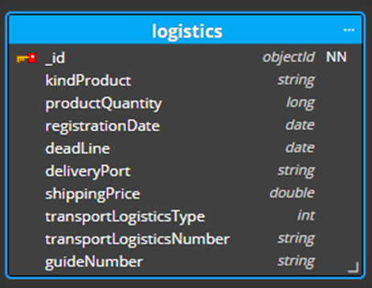
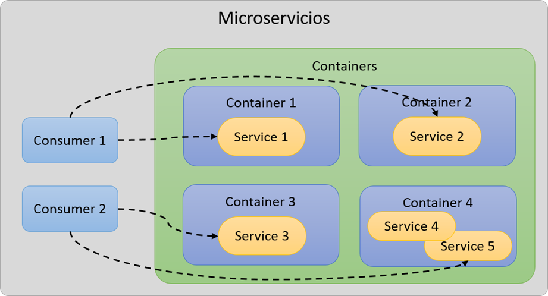

SOLUCIÓN

o	Diagrama E-R del modelo de datos, no presentar la solución una foto/Scan del diagrama creado en papel, Deberá diagramarse con alguna herramienta a elección del candidato.

Se construye un solo documento debido a que se obtiene dos tablas con iguales características:

Lo podemos evidenciar en la descripción del problema:
La logística de camiones cuenta con un plan de entrega, donde se debe obtener los siguientes datos.
1. Tipo de producto
2. Cantidad del producto
3. Fecha de registro
4. Fecha de entrega
5. Bodega de entrega
6. Precio de envió
7. Placa del vehículo (El formato debe corresponder a 3 letras iniciales y 3 números finales)
8. Numero de guía (Numero único alfanumérico de 10 dígitos)

La logística marítima cuenta con el siguiente plan de entrega, donde se debe obtener los siguientes datos.
1. Tipo de producto
2. Cantidad del producto
3. Fecha de registro
4. Fecha de entrega
5. Puerto de entrega
6. Precio de envío
7. Numero de flota (El formato debe corresponder a 3 letras iniciales, seguidas de 4 números y finalizando con una letra)
8. Numero de guía (Numero único alfanumérico de 10 dígitos)

Entonces adicionamos un campo adicional que corresponde a tipo de logística

Diagrama E-R:

o	Script de base de datos de la solución.

Se implemento en una base de datos relacional y con Mongo JPA se puede construir el Documento sin generar una tabla:

db.createCollection( 'logistics', {validator: {$jsonSchema: {bsonType: 'object',title:'logistics',properties: {kindProduct: {bsonType: 'string'},productQuantity: {bsonType: 'long'},registrationDate: {bsonType: 'date'},deadLine: {bsonType: 'date'},deliveryPort: {bsonType: 'string'},shippingPrice: {bsonType: 'double'},transportLogisticsType: {bsonType: 'int'},transportLogisticsNumber: {bsonType: 'string'},guideNumber: {bsonType: 'string'}}         }      }});

o	URL del repositorio GIT.

Repositorio: https://github.com/jsonArmando/Logistics.git

Con sus respectivos commits, nomenclatura y buenas prácticas

o	Artefactos de despliegue de la solución.

Se adjunta el artefacto en el repositorio:

o	Definición de buenas prácticas.

Para la construcción del aplicativo se usa principios SOLID

Para revisión de código se usa SONARQUBE
o	Justificación de las tecnologías empleadas y patrones de diseño empleados.

Java 11: implementación de programación funcional

Spring-Boot: 2.7.3

Spring-Data-MongoDB

Spring-Web

Lombok

Mapper Struct: 1.4.2

Javax-Validation: 2.0.1

Swagger: 2.9.2

JWT: 0.9.1

Rest-Assured

Junit

Arquitectura de Microservicios en Java:

Los microservicios son un enfoque arquitectónico y organizativo para el desarrollo de software donde el software está compuesto por pequeños servicios independientes que se comunican a través de API bien definidas. Los propietarios de estos servicios son equipos pequeños independientes.

El patrón Data Transfer Object  (DTO/VO)

Va de la mano con el patrón de diseño DAO.

Se utiliza para transferir varios atributos entre el cliente y el servidor o viceversa, básicamente consta de 2 clases:

La primera es una clase java conocida como Value Object que únicamente contiene sus atributos, constructor, getters y setters, esta clase no tiene comportamiento.
La segunda es una clase del lado del servidor conocida como clase de negocio (en la implementación también se conoce como Business Object) es la que se encarga de obtener datos desde la base de datos y llenar la clase Value Object y enviarla al cliente, o a su vez recibir la clase desde el cliente y enviar los datos al servidor, por lo general tiene todos los métodos CRUD (create, read, update y delete).
