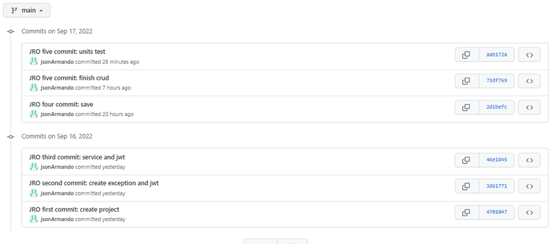

SOLUCIÓN

o	Diagrama E-R del modelo de datos, no presentar la solución una foto/Scan del diagrama creado en papel, Deberá diagramarse con alguna herramienta a elección del candidato.

Se construye un solo documento debido a que se obtiene dos tablas con iguales características:

Lo podemos evidenciar en la descripción del problema:
La logística de camiones cuenta con un plan de entrega, donde se debe obtener los siguientes datos.
1. Tipo de producto
2. Cantidad del producto
3. Fecha de registro
4. Fecha de entrega
5. Bodega de entrega
6. Precio de envió
7. Placa del vehículo (El formato debe corresponder a 3 letras iniciales y 3 números finales)
8. Numero de guía (Numero único alfanumérico de 10 dígitos)

La logística marítima cuenta con el siguiente plan de entrega, donde se debe obtener los siguientes datos.
1. Tipo de producto
2. Cantidad del producto
3. Fecha de registro
4. Fecha de entrega
5. Puerto de entrega
6. Precio de envío
7. Numero de flota (El formato debe corresponder a 3 letras iniciales, seguidas de 4 números y finalizando con una letra)
8. Numero de guía (Numero único alfanumérico de 10 dígitos)

Entonces adicionamos un campo adicional que corresponde a tipo de logística

Diagrama E-R:

o	Script de base de datos de la solución.

Se implemento en una base de datos relacional y con Mongo JPA se puede construir el Documento sin generar una tabla:

db.createCollection( 'logistics', {validator: {$jsonSchema: {bsonType: 'object',title:'logistics',properties: {kindProduct: {bsonType: 'string'},productQuantity: {bsonType: 'long'},registrationDate: {bsonType: 'date'},deadLine: {bsonType: 'date'},deliveryPort: {bsonType: 'string'},shippingPrice: {bsonType: 'double'},transportLogisticsType: {bsonType: 'int'},transportLogisticsNumber: {bsonType: 'string'},guideNumber: {bsonType: 'string'}}         }      }});

o	URL del repositorio GIT.

Repositorio: https://github.com/jsonArmando/Logistics.git

Con sus respectivos commits, nomenclatura y buenas prácticas

